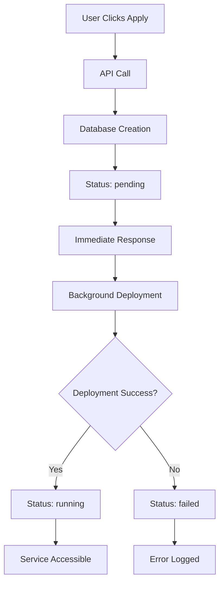

# 🚀 Service Creation Flow Documentation

## Overview
This document explains the complete user flow for creating and managing services in the Edusathi platform, from user registration to service deployment.

---

## 🎯 Complete User Journey

### Step 1: User Registration & Business Setup
```
👤 User Registration → Business Profile → Business ID Assignment
```

**What happens:**
- User visits the platform and creates an account
- Sets up business profile with company details
- System assigns a unique `businessId`
- User gets access to business dashboard

**Data Created:**
```javascript
// User Profile
{
  id: "user_123",
  name: "John Doe",
  email: "john@mybusiness.com",
  role: "business"
}

// Business Profile  
{
  businessId: "biz_456",
  userId: "user_123",
  companyName: "My Academy",
  contactInfo: {...}
}
```

---

### Step 2: Plan Purchase & Payment
```
💳 Plan Selection → Payment → BusinessPurchase Record
```

**User Actions:**
1. Browses available pricing plans
2. Selects a plan (Basic/Pro/Enterprise)
3. Provides domain name and institute details
4. Makes payment via Razorpay

**System Response:**
```javascript
// BusinessPurchase Record Created
{
  businessId: "biz_456",
  domain: "myacademy.com",
  subdomain: "admin.thecomputeracademy.org",
  instituteName: "My Learning Academy", 
  plan: "pro",
  status: "paid",
  razorpay_payment_id: "pay_xyz123",
  createdAt: "2024-10-19T10:00:00Z"
}
```

---

### Step 3: Template Selection
```
🎨 Dashboard Access → Template Browser → Apply Template
```

**Frontend Flow (`BusinessDashboard.tsx`):**

```jsx
// User sees available templates
const templates = [
  { id: 1, name: "Education Template", category: "Learning" },
  { id: 2, name: "Business Template", category: "Corporate" }
];

// When user clicks "Apply"
const applyTemplate = async (templateId) => {
  try {
    // Get user ID from session
    const userId = getUserIdFromSession();
    
    // Trigger service creation
    const response = await ServicesAPI.createService({
      templateId: templateId,
      businessId: userId
    });
    
    // Show success message
    toast({
      title: "Service Creation Started",
      description: `Your service is being deployed on port ${response.port}`
    });
    
  } catch (error) {
    toast({
      title: "Error", 
      description: error.message,
      variant: "destructive"
    });
  }
};
```

---

### Step 4: Service Creation API Call
```
🔄 API Request → Validation → Database Creation → Immediate Response
```

**API Endpoint:**
```
POST /api/service/create
Content-Type: application/json

{
  "businessId": "biz_456"
}
```

**Controller Processing (`services.controller.js`):**

```javascript
export const createService = async (req, res) => {
  try {
    const { businessId } = req.body;
    
    // 1. Validate business has paid plan
    const businessPurchase = await BusinessPurchase.findOne({
      businessId: businessId,
      status: 'paid'
    }).sort({ createdAt: -1 });
    
    if (!businessPurchase) {
      return res.status(404).json({
        success: false,
        message: 'No valid business purchase found'
      });
    }
    
    // 2. Extract deployment configuration
    const {
      domain,               // "myacademy.com"
      subdomain,           // "admin.thecomputeracademy.org" 
      instituteName,       // "My Learning Academy"
    } = businessPurchase;
    
    // 3. Auto-assign port number
    const lastService = await Service.findOne().sort({ _id: -1 });
    const port = lastService ? lastService.port + 1 : 4074;
    
    // 4. Create service record in database
    const serviceData = {
      businessId,
      domain,
      subdomain, 
      instituteName,
      port,
      status: 'pending'  // ← Starts as pending
    };
    
    const savedService = await new Service(serviceData).save();
    
    // 5. Send immediate response to user
    res.status(201).json({
      success: true,
      message: 'Service creation started successfully',
      service: savedService,
      port: port,
      status: 'pending',
      note: 'Service deployment is in progress. Status will be updated automatically.'
    });
    
    // 6. Start background deployment (non-blocking)
    deployServiceAsync(savedService._id, {
      name: instituteName,
      domain,
      subdomain,
      port
    });
    
  } catch (error) {
    console.error('Service creation error:', error);
    res.status(500).json({ success: false, message: error.message });
  }
};
```

---

### Step 5: Background Deployment Process
```
☁️ SSH Connection → Code Deployment → Service Configuration → Status Update
```

**Async Deployment Function:**

```javascript
async function deployServiceAsync(serviceId, deploymentConfig) {
  try {
    console.log(`🚀 Starting deployment for service ${serviceId}...`);
    
    // Call deployment automation
    const deploymentResult = await createServiceInstance(deploymentConfig);
    
    // Update database based on result
    let updateData;
    if (deploymentResult && deploymentResult.success) {
      updateData = { 
        status: 'running',
        deployedAt: new Date()
      };
      console.log(`✅ Service ${serviceId} deployed successfully`);
    } else {
      updateData = { 
        status: 'failed',
        error: deploymentResult?.error || 'Deployment failed'
      };
      console.log(`❌ Service ${serviceId} deployment failed`);
    }
    
    // Update service status in database
    await Service.findByIdAndUpdate(serviceId, updateData);
    
  } catch (error) {
    console.error(`❌ Deployment error for service ${serviceId}:`, error);
    
    // Mark service as failed
    await Service.findByIdAndUpdate(serviceId, { 
      status: 'failed',
      error: error.message 
    });
  }
}
```

---

### Step 6: Server Deployment Automation
```
🖥️ AWS EC2 → Git Clone → Environment Setup → PM2 Start → Nginx Config
```

**Deployment Script (`createService.service.js`):**

```javascript
export const createServiceInstance = async (business) => {
  return new Promise((resolve, reject) => {
    const INSTANCE_IP = "13.200.247.34";
    const KEY_PATH = "../../max.pem";
    
    const command = `
ssh -o StrictHostKeyChecking=no -i ${KEY_PATH} ubuntu@${INSTANCE_IP} << 'ENDSSH'

# 1. Navigate to web directory
cd /var/www/

# 2. Clone application code
git clone https://github.com/sujay090/Institution_docker.git ${business.name}
cd ${business.name}

# 3. Configure environment files
# Update center/.env (Student Portal)
cd center
echo "VITE_API_BASE_URL=https://${business.domain}/api/v1" > .env

# Update client/.env (Admin Dashboard)  
cd ../client
echo "VITE_API_BASE_URL=https://${business.subdomain}/api/v1" > .env

# Update server/.env (Backend API)
cd ../server  
echo "PORT=${business.port}" > .env

# 4. Install dependencies and start backend
npm install
pm2 start src/index.js --name "${business.name}"
pm2 save

# 5. Configure Nginx for domain routing
sudo tee "/etc/nginx/sites-available/${business.name}" > /dev/null << 'NGINXEOF'
server {
    server_name ${business.domain};
    root /var/www/${business.name}/center/dist;
    
    location /api {
        proxy_pass http://localhost:${business.port};
    }
    
    location / {
        try_files $uri $uri/ /index.html;
    }
    
    listen 80;
}

server {
    server_name ${business.subdomain};
    root /var/www/${business.name}/client/dist;
    
    location /api {
        proxy_pass http://localhost:${business.port};
    }
    
    location / {
        try_files $uri $uri/ /index.html;
    }
    
    listen 80;
}
NGINXEOF

# 6. Enable site and reload Nginx
sudo ln -s /etc/nginx/sites-available/${business.name} /etc/nginx/sites-enabled/
sudo nginx -t && sudo systemctl reload nginx

echo "🎉 DEPLOYMENT_COMPLETED_SUCCESSFULLY"

ENDSSH
    `;
    
    exec(command, { timeout: 300000 }, (error, stdout, stderr) => {
      if (error) {
        reject({ success: false, error: error.message });
        return;
      }
      
      if (stdout.includes('DEPLOYMENT_COMPLETED_SUCCESSFULLY')) {
        resolve({ 
          success: true, 
          message: 'Service deployed successfully',
          domain: business.domain,
          port: business.port 
        });
      } else {
        reject({ success: false, error: 'Deployment did not complete' });
      }
    });
  });
};
```

---

## 📊 Service Status Lifecycle



**Status Flow:**
1. **pending** - Service created in database, deployment starting
2. **deploying** - Background deployment in progress  
3. **running** - Service successfully deployed and accessible
4. **failed** - Deployment failed, error logged

---

## 🎯 Final User Experience

### What User Gets After Successful Deployment:

**1. Student Learning Portal:**
```
https://myacademy.com
- Course catalog
- Student enrollment  
- Learning materials
- Progress tracking
```

**2. Admin Management Dashboard:**
```  
https://admin.thecomputeracademy.org
- Student management
- Course creation
- Analytics & reports
- System settings
```

**3. Backend API:**
```
https://myacademy.com/api/v1/
- Authentication endpoints
- Course management APIs
- Student data APIs
- File upload handling
```

**4. Database & Storage:**
- Dedicated MongoDB collections
- File storage for uploads
- User data isolation

---

## 🔧 Service Management Operations

### Available Operations:
```javascript
// Get all services
GET /api/service

// Get specific service  
GET /api/service/:id

// Stop service
POST /api/service/:id/stop

// Restart service
POST /api/service/:id/restart  

// Delete service
DELETE /api/service/:id
```

### Admin Dashboard Integration:
Users can monitor and manage their services through:
- Service list with real-time status
- Start/Stop/Restart controls
- Detailed service information
- Error logs and diagnostics

---

## 💡 Key Benefits

### For Users:
- ✅ **Instant Feedback** - Immediate confirmation of service creation
- ✅ **No Timeouts** - Quick response regardless of deployment time
- ✅ **Status Tracking** - Real-time updates on deployment progress
- ✅ **Self-Service** - Complete control over service management

### For System:
- ✅ **Scalability** - Multiple concurrent deployments
- ✅ **Reliability** - Database persistence independent of deployment
- ✅ **Maintainability** - Clear separation of concerns
- ✅ **Monitoring** - Comprehensive logging and error tracking

---

## 🚨 Error Handling

### Common Scenarios:
1. **No Business Purchase** - User hasn't paid for a plan
2. **Port Conflicts** - Auto-increment prevents collisions  
3. **Deployment Failures** - Network issues, server problems
4. **Domain Conflicts** - DNS or Nginx configuration issues

### Recovery Mechanisms:
- Automatic retry logic for transient failures
- Detailed error logging for debugging
- Status rollback on deployment failure
- Manual intervention capabilities for admins

---

## 📝 Database Schema

### Service Model:
```javascript
{
  _id: ObjectId,
  businessId: ObjectId,           // Reference to business
  domain: String,                 // Primary domain (myacademy.com)
  subdomain: String,             // Admin subdomain  
  instituteName: String,         // Display name
  port: Number,                  // Unique port assignment
  status: Enum,                  // pending|running|stopped|failed
  createdAt: Date,              // Service creation time
  deployedAt: Date,             // Deployment completion time
  stoppedAt: Date,              // Last stop time
  restartedAt: Date,            // Last restart time
  error: String                 // Last error message
}
```

### BusinessPurchase Model:
```javascript
{
  _id: ObjectId,
  businessId: ObjectId,
  domain: String,
  subdomain: String, 
  instituteName: String,
  plan: String,
  status: String,               // paid|pending|failed
  razorpay_payment_id: String,
  createdAt: Date
}
```

---

This comprehensive flow ensures a smooth, professional experience for users while maintaining system reliability and scalability! 🎉